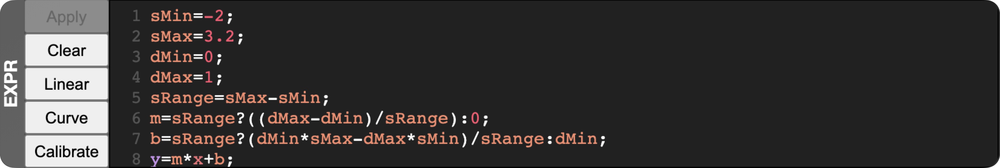
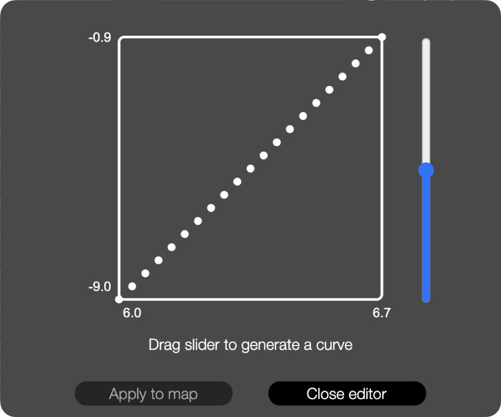
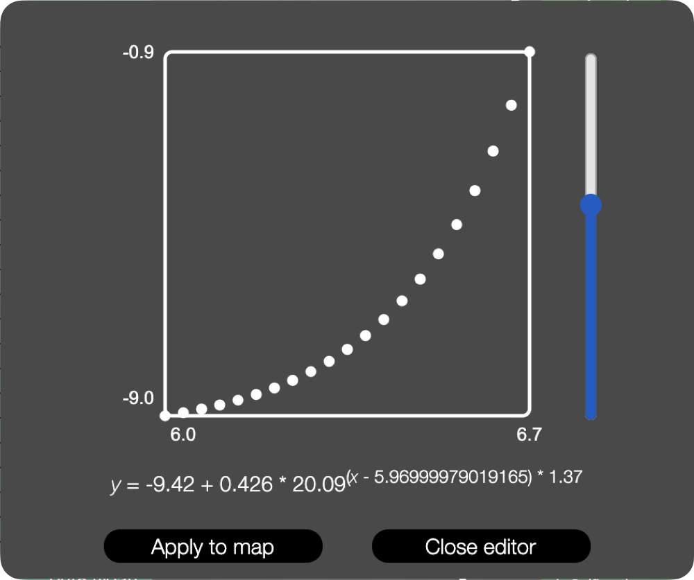

#  WebMapper: a browser-based interface for administration of control-mapping networks

 

- Contributors: Stephen Sinclair, Joseph Malloch, Aaron Krajeski, Jon Wilansky, Travis West, Brady Boettcher, Johnty Wang, Matt Peachey, Mathias Bredholt, Christian Frisson, and Marcello Giordano
- Resources: [Discussion list][group], [libmapper documentation][libmapper]

During a number of projects we have found that the "mapping" task – in which correspondences are designed between sensor/gesture signals and the control parameters of media synthesizers – is by far the most challenging aspect of designing digital musical instrument or other interactive systems. This problem becomes even worse when attempted in collaborative settings, since collaborators often have different perspectives, vocabularies and tools.

We have developed tools for supporting this task, including the [Digital Orchestra Toolbox][DOT] for MaxMSP and the software library [libmapper][libmapper]. The latter project enables the creation of a network of distributed "devices" which may be sources of real-time control data (instruments) and/or destinations for control data (e.g. sound synthesizers). The software library handles device discovery, stream translation (e.g. type coercion, vector padding or truncation) and network transportation, but does not attempt to create mappings automatically. Instead, the mapping designer(s) use the library to create maps between distributed signals, usually using a graphical user interface to interact with the mapping network. To date, GUIs for libmapper have been implemented in MaxMSP, Javascript/HTML5, C++/Qt, and Python/wxWidgets. **Webmapper** is one of these interfaces, implemented as a Python back-end using libmapper's Python bindings to interact with the libmapper network, and a front-end running in a web browser as HTML and Javascript.

### Functionality

Webmapper aims to support the mapping task in three ways:

1. Aiding discovery and exploration of active devices and their signals. Currently 8 different "views" of the mapping network are available, each using a different visualization approach.
2. Providing an interactive graphical interface for creating, editing, and destroying data-streaming connections ("maps") between signals. 
3. Supporting saving and loading of mapping sets (sometimes referred to as 'sessions'), including support for mapping transportability (cf. the [GDIF project][GDIF])

All libmapper-compatible GUIs function as “dumb terminals” — no handling of mapping commands takes place in the GUI, but rather they are only responsible for representing the current state of the network, and issuing commands on behalf of the user. This means that an arbitrary number of GUIs can be open simultaneously supporting both remote network management and collaborative creation and editing during the mapping task.

### Currently missing:

* collaborative undo/redo

## To run standalone application

Simply open the application. It should automatically scan the network for devices and signals.

## To run from source:

Note: webmapper is developed and works with Chromium/Chrome. It may work with other browsers.

1. Build and install [libmapper][libmapper] or `pip3 install libmapper`
2. Download [mappersession][mappersession] or `pip3 install mappersession`
3. Run webmapper.py from terminal
4. Terminal will display "serving at port #####"
5. A browser window should be opened automatically and directed to the correct port.

If the browser doesn't open, open it manually and type "localhost:#####" into the address bar, where ##### is the same string of numbers displayed in the terminal.

### Specifying network interface at launch

The network interface can be specified using a command-line argument when launching webmapper:

~~~
python webmapper.py --iface lo0
~~~

### Running without a local front end

By default webmapper will open a browser window when it is launched, but there may be situations for which this is not the correct behaviour, such as running the webmapper back-end on a computer without a display and running the front-end remotely. The flag `--no-browser` will prevent webmapper from trying to open a browser window locally. The flag `--stay-alive` keeps webmapper runnning after a connected front-end disconnects.

~~~
python webmapper.py --no-browser --stay-alive
~~~

## To build a standalone application for macOS:

~~~
python setup.py py2app
~~~

---

## Saving and loading:

Released versions of Webmapper use "naïve" file loading, in which maps specifications loaded from file are matched against all of the devices currently known to Webmapper that have not been 'hidden' using the Chord or Console views. This is intended to support *transportability* of mapping specifications between similar devices if their parameter spaces are structured similarly (cf. the [GDIF project][GDIF]). It also ensures that files will still load if a device receives a different ordinal id than the one used when the file was saved. Unfortunately, this naïve approach may also cause unintended consequences if a file is loaded when multiple instances of an involved device are present – to avoid these problems, see [hiding devices](#hiding_devices) in the description of the Chord View below.

### In development: map staging

We are working on a new functionality called *map staging*. While the previous naïve approach loaded saved maps against all of the device names in the current tab, loading a file now switches to a new view showing only devices and network links. The file is parsed to retrieve the number of devices involved, and an interactive object is displayed allowing the user to assign device representations from the file to devices that are active on the network. Once the devices have been assigned, clicking on the central file representation launches an attempt to recreate the saved maps.

The [mappersession][mappersession] module currently supports including an optional "device map" argument when loading a file, specifying how devices in the file should be mapped onto currently active devices. A graphical interface for building this "device map" remains to be implemented.

### Searching/filtering signals

Text boxes are provided for filtering source and destination signals by name.

## Creating maps

Lines representing inter-signal **maps** may be drawn between signals using drag-and-drop or by clicking on the source signal and then the destination signal.

Webmapper also supports the creation and representation of *convergent* maps. If you click and drag a signal as you would usually do when making a map you should notice that the map you are creating will snap to existing map edges as you drag the mouse over them. If you release the mouse while snapped to an existing map, a radial menu will appear offering several preset convergent mapping methods:

1. add the new signal to the existing expression
2. multiply the existing expression by the new signal
3. take the average of all the sources of the convergent map
4. use the libmapper defined default expression

## Selecting maps

Maps can be selected by either clicking on them or 'crossing' them by clicking and dragging through the map. Keep dragging or hold down the `Shift` key to select multiple maps.

## Editing map properties

If a map or maps are selected, the *map property editor* becomes active. This part of the UI contains widgets for viewing and changing the properties of the selected map(s). Currently, some map properties can only be edited using the Console view or via hotkeys listed in the chart below.

| Action (while maps are selected)                              | Key
| ------------------------------------------------------------- | ---
| Invoke the curve editor.                                      | `C`
| Focus on expression editor                                    | `E`
| Switch selected maps to use UDP networking.                   | `U`
| Switch selected maps to use TCP networking.                   | `T`
| Force selected maps to process expressions at the destination.| `D`
| Force selected maps to process expressions at the source (if possible).| `S`
| Toggle the `use_inst` property of selected maps.              | `I`
| Toggle muting for selected maps.                              | `M`

### Expression editor

This mode allows the user to view and edit the expression used for processing values streaming on this map. Please refer to the libmapper [expression syntax documentation](./doc/expression_syntax.md) for more information.

Changes to the map expression can be applied to the map by clicking on the `Apply` button to the left of the editor or by using the shortcut keys `Meta`+`Return`.

### Curve editor

Pressing the `C` key while maps are selected invokes the curve editor. Dragging the slider up or down will modify the generated curve. Once a curve has been applied to a map the generated expression will take effect. The curve editor can be dismissed by clicking the `close editor` button or by clicking in the UI outside the editor.

## Global Commands

| Action                        | KDE/Gnome/Windows | macOS
| ----------------------------- | ----------------- | -----------
| Switch to view *N, N* = 1...8 | `Ctrl`+*N*        | `⌘ Cmd`+*N*
| Open file.                    | `Ctrl`+`O`        | `⌘ Cmd`+`O`
| Save file                     | `Ctrl`+`S`        | `⌘ Cmd`+`S`
| Filter signal names.          | `Ctrl`+`F`        | `⌘ Cmd`+`F`
| Select all displayed maps     | `Ctrl`+`A`        | `⌘ Cmd`+`A`
| Jump between text boxes       | `tab`             | `tab`
| Remove selected maps          | `del`             | `delete`
| Increase/decrease zoom        | `+``-`            | `+``-`
| Pan canvas                    | `←``↑``→``↓`      | `←``↑``→``↓`
| Reset pan and zoom            | `Ctrl`+`0`        | `⌘ Cmd`+`0`
| Toggle muting for selected maps, or hold down the while creating a new map to set its initial `muted` property to `true`.  | `M` | `M`

### Scrolling and panning

Scroll and pan using using multitouch gestures, mouse scroll wheel or arrow keys. Scrolling over signal tables will be constrained to the table only, while scrolling and panning over canvas areas is will affect the entire display.

### Zooming

Zoom using multitouch pinch and spread gestures or the `+`/`-` keys. Applying zoom commands over tables will zoom the table only, while zoom commands applied over canvas areas will zoom the entire display.

## Color:

Color is used throughout the UI for differentiating devices and their signals. The color used to display a given device is generated from a hash of the device's unique name. This means that although this UI displays devices that are instantiated ad hoc in a distributed network, the color for a given device will remain the same no matter how many times it disappears and reappears.  The hashing algorithm is designed so that instances of the same device will have very similar (but distinguishable) colors.

## Views:

We have explored several alternative visualization and interaction techniques, which allow more informed and flexible interaction with the mapping network. Crucially, we believe that there is no need for a single “correct” user interface; rather, different network representations and interaction approaches may be useful to different users, for different mapping tasks, or at different times.

**Webmapper** currently includes eight different views. Following is a brief description of each view, including any view-specific interactions. For each, the name of the view is displayed along with the view's icon representation in the view selector widget, followed by the shortcut key displayed as `Command-N`.

###  Chord view

* Shortcut: `Command-1`

This view displays only devices and network links between them. It can be used to gain an overview of the mapping network. Hovering over a device or link representation will cause an information box to appear displaying additional metadata.

#### <a name="hiding_devices">Hiding devices</a>

Devices can be "hidden" from the rest of the views by clicking on them. This will cause the device representation to become gray. While "hidden", a device and its signals will not appear in any of the remaining views, and its signals will not be included when calculating matches for file-loading. Clicking again on a hidden device will return it to an unhidden state.

###  List view

* Shortcut: `Command-2`

The primary view used in our mapping GUIs is based on the common structure of diagrams used to describe DMI mapping in the literature – a bipartite graph representation of the maps, in which sources of data appear on the left-hand side of the visualization and destinations (or "sinks") for data appear on the right.

#### View-specific interactions

The lists of source and destination signals are arranged hierarchically. Groups of signals can be collapsed by clicking on the parent node, potentially making the list easier to navigate.

###  Grid view

* Shortcut: `Command-3`

In this view, `source` signals are listed along the left side of a grid, while `destination` signals are listed along the top. Maps connecting the signals are drawn as triangles at the intersection of their sources and destination, with the point of the triangle indicating the direction of dataflow: **up** for maps flowing from a signal in the left table to a signal in the top table, or **left** for maps flowing from the top to the left. In the case of maps involving only signals in one table, there is no intersection point and the maps are drawing using directed edges as in the **List View**.

#### View-specific interactions

The lists of source and destination signals are arranged hierarchically. Groups of signals can be collapsed by clicking on the parent node, potentially making the list easier to navigate.

###  Canvas view

* Shortcut: `Command-4`

The canvas view is loosely modeled after the UI for the application [Input Configurator (ICon)][ICon] by Pierre Dragecevic and Stéphane Huot. In this view, both input and output signals appear in a list on the left side, and can be dragged into the main canvas area.

#### View-specific interactions

* Drag a signal from the list on the left to create an associated canvas object.
* Click and drag the middle of a canvas object to reposition it.
* Drag a canvas object back to the table on the left to remove it from the canvas.
* Click and drag the right or left edges of a canvas object to create a map. Drop the other end of the map on the desired signal.

###  Graph view

* Shortcut: `Command-5`

The graph view plots signals on a 2D graph, with x and y axes chosen by the
user from the signals' properties. Interestingly, some signal properties
(such as min and max) may have vector values, meaning that a given signal
may have more than one location on the graph.

#### View-specific interactions

* Choose the property to be displayed on the X and Y axes by clicking on the axis label and choosing a property from the dropdown menu. If `none` is chosen, a force-directed layout will be applied to that axis.  A fully force-directed plot can be created by choosing `none` for both axes.

###  Hive plot view

* Shortcut: `Command-6`

In this view, each device is given its own axis arranged radially. Signals belonging to a device are displayed as nodes distributed evenly along the device axis.

###  Parallel coordinate view

* Shortcut: `Command-7`

In this view, each device is given its own axis arranged vertically in parallel. Signals belonging to a device are displayed as nodes distributed evenly along the device axis.

###  Console view

* Shortcut: `Command-8`

This view presents a "console" for performing text-based interaction with the mapping network.

## Working Offline

Status: planning

[libmapper]: https://github.com/libmapper/libmapper
[mappersession]: https://github.com/libmapper/mappersession
[GDIF]: http://www.idmil.org/projects/gdif
[ICon]: http://inputconf.sourceforge.net/
[DOT]: http://idmil.org/dot
[group]: https://groups.google.com/forum/#!forum/dot_mapper
